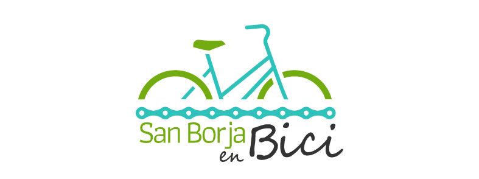
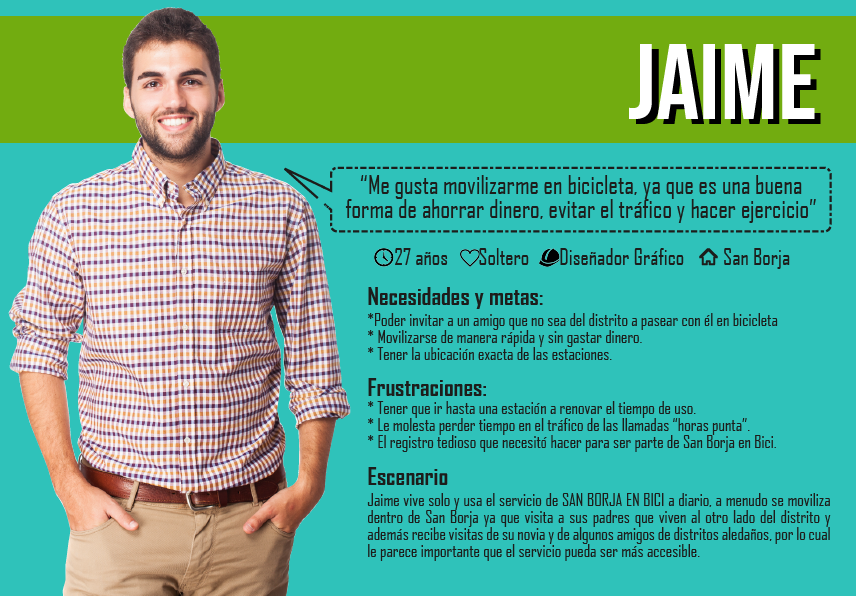
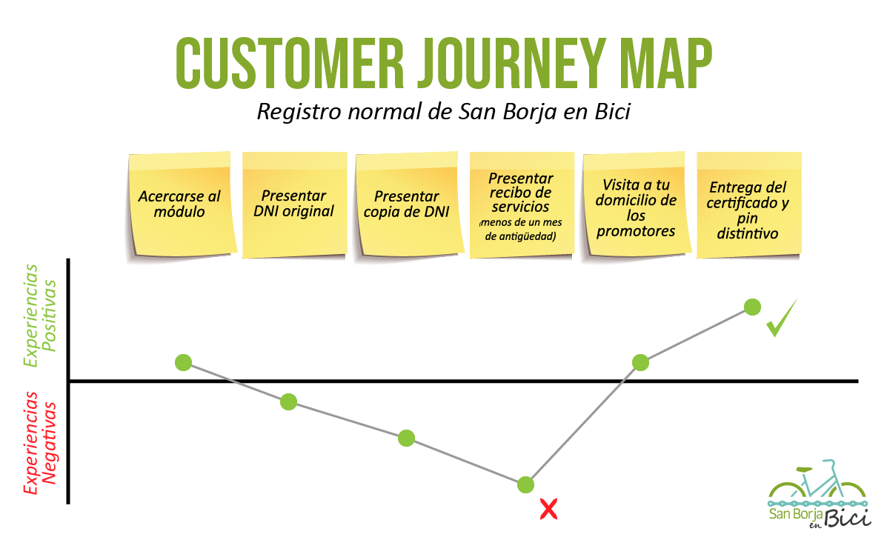
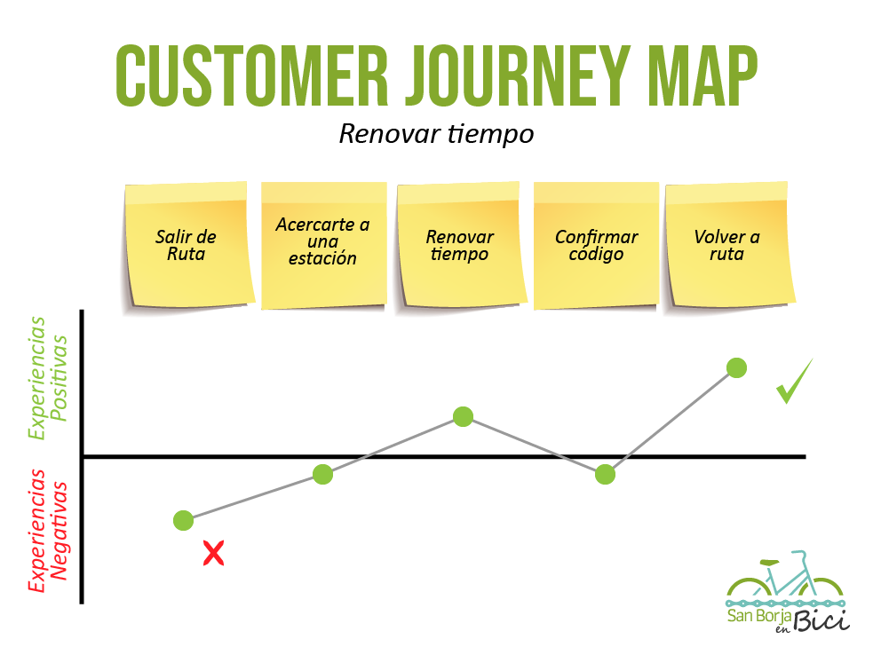
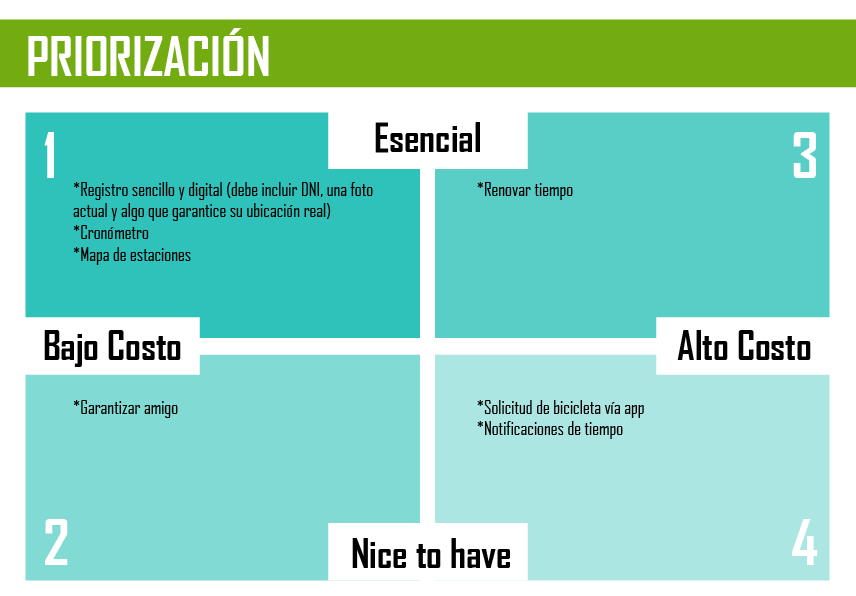
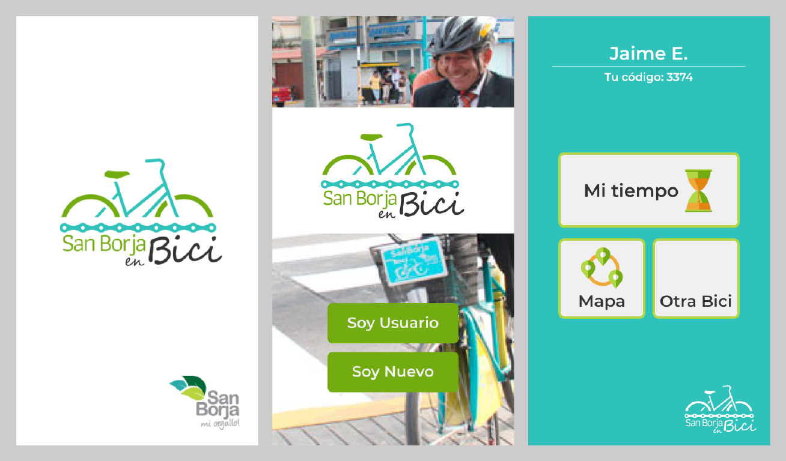

# San Borja en Bici

San Borja en Bici busca crear una herramienta digital, que facilite la inscripción de los nuevos usuarios, así como el acceso a las bicis, las estaciones, y los tiempos de préstamos. 

## Desarrollado para 
[Laboratoria](http://laboratoria.la)

## SAN BORJA EN BICI-APP

## **OBJETIVO**
Crear una herramienta digital, que facilite la inscripción de los nuevos usuarios asi como el acceso a las bicis, las estaciones, y los tiempos de préstamos a sus usuarios.

## 1.RESEARCH
### 1.1 Research Cualitativo
#### Entrevistas a Usuarios

Entrevistamos a personas que son usuarias del programa, de esta manera obtuvimos una mayor perspectiva sobre sus necesidades.

[Guia de Entrevista](https://drive.google.com/open?id=17Os8dzaBTSFZMH6QHepuYRktR5VMdTaL)
#### Entrevistas a Stakeholders

Realizamos entrevistas al personal que trabaja en las estaciones, con el fin de conocer los principales problemas que enfrentan.

[Guia de Entrevista](https://drive.google.com/open?id=1v3Nutu8r5T4txjRUiTrCp0kmg5zeR_O1)

### 1.2 Research Cuántitativo
#### Benchmark 

Pudimos encontrar servicios similares en Chile y Colombia.

ANÁLISIS COMPARATIVO

 

## 2.SÍNTESIS

### 2.1 User Persona

### 2.2 Problem Statement

* Jaime necesita poder renovar el tiempo de uso de una bicicleta sin ir a una estación para ahorrar tiempo.
* Jaime necesita poder pasear en bicicleta con un acompañante para evitar tener que usar carro cuando alguien lo visite.
* Jaime necesitaba poder hacer un registro sencillo y sin salir de su hogar para no perder tiempo.
* Jaime necesita saber cuanto tiempo de uso le queda para poder renovar su tiempo.
* Jaime necesita saber cuales son las estaciones más cercanas para saber donde dejará la bicicleta.

### 2.3 HMW

* HMW renovar el tiempo para uso de bicicletas de manera más sencilla.
* HMW hacer para poder hacer uso del servicio con un acompañante.
* HMW que el registro sea más sencillo.
* HMW para indicar el tiempo restante.
* HMW para mostrar las estaciones.

### 2.4 What if

* What if no tuviera que renovar el tiempo.
* What if se le daría más bicicletas a personas acompañadas.
* What if no necesita registrarse.
* What if no hay tiempo.
* What if las estaciones están muy cerca.

### 2.5 Journey Maps

## 3.IDEACIÓN

### 3.1 Feature List

* Registro sencillo y digital (debe incluir DNI, una foto actual y algo que garantice su ubicación real)
* Cronómetro
* Renovar tiempo
* Solicitud de bicicleta vía app
* Notificaciones de tiempo
* Garantizar amigo
* Mapa de estaciones

### 3.2 Priorización 

### 3.3 MVP

Se decidió usar una app que contenga las siguientes funcionalidades:
*Registro sencillo y digital (debe incluir DNI, una foto actual y algo que garantice su ubicación real)
*Cronómetro
*Renovar tiempo
*Garantizar amigo
*Mapa de estaciones

## 4.PROTOTIPADO

[Prototipo final](#)

### Integrantes:

- Lilliam Haro
- Marina Rodriguez
- Silvia Fuentes
- Andrea Encarnación 
- Esthefany Humpiri 
