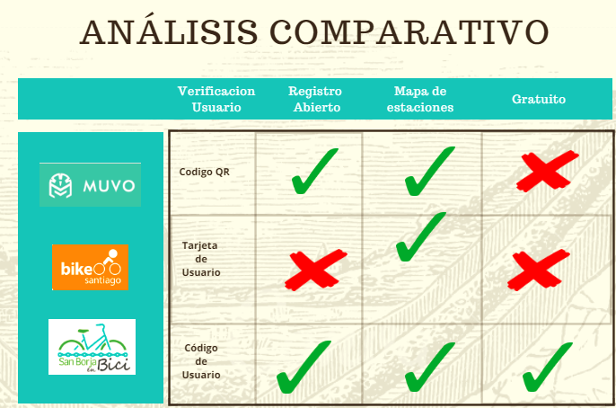

# SAN BORJA EN BICI-APP

### **OBJETIVO**
Crear una herramienta digital, que facilite la inscripción de los nuevos usuarios asi como el acceso a las bicis, las estaciones, y los tiempos de préstamos a sus usuarios.

## Tabla de contenido

1.- [RESEARCH](#research)

2.- [IDEACIÓN](#ideación)

3.- [FLUJO DE LA APLICACIÓN](#flujo-de-la-aplicación)

4.- [DEMO](#demo)

## 1.RESEARCH
#### 1.1 Research Cualitativo
##### Entrevistas a Usuarios

Entrevistamos a personas que son usuarias del programa, de esta manera obtuvimos una mayor perspectiva sobre sus necesidades.

[Guia de Entrevista](https://drive.google.com/open?id=17Os8dzaBTSFZMH6QHepuYRktR5VMdTaL)
##### Entrevistas a Stakeholders

Realizamos entrevistas al personal que trabaja en las estaciones, con el fin de conocer los principales problemas que enfrentan.

[Guia de Entrevista](https://drive.google.com/open?id=1v3Nutu8r5T4txjRUiTrCp0kmg5zeR_O1)

#### 1.2 Research Cuántitativo
##### Benchmark 

Pudimos encontrar servicios similares en Chile y Colombia.

ANÁLISIS COMPARATIVO

 

## 2.IDEACIÓN
    

 ### Integrantes:

- Lilliam Haro
- Marina RH
- Silvia 
- Andrea Encarnación 
- Esthefany Humpiri 
